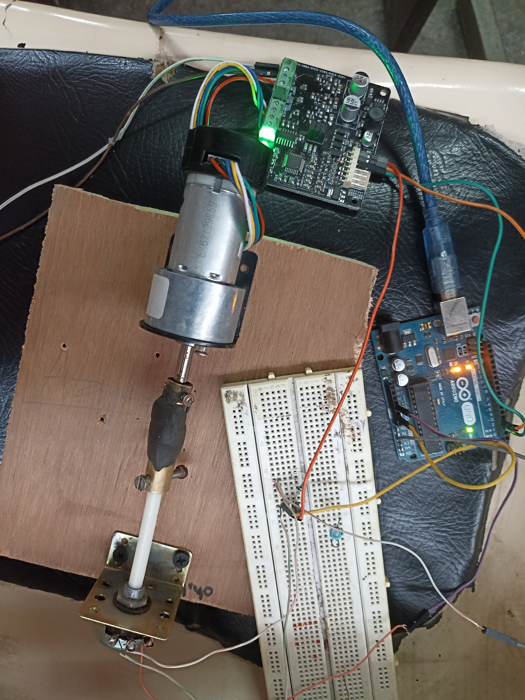

# DC motor to Servo ML Model

This project uses **Machine Learning** to map DC motor values to corresponding **servo motor positions**, enabling more precise control or prediction in robotics systems using potentiometer.

It’s a part of my hands-on experimentation with robotics + ML to enhance motion control through data-driven approaches.

---

## Project Overview

- Collects data from DC motor and servo movements
- Trains a regression/classification model to map DC input → Servo angle (or vice versa)
- Evaluates model performance using various metrics
- Useful in robotics where feedback or estimation is required

---

## Motivation

I wanted to explore how machine learning can be used to **learn motion behavior** and help in predicting or correcting actuator positions, especially where direct control is noisy or hard to tune.

---

## Setup

